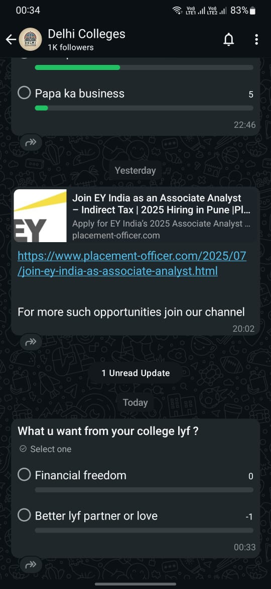

# WhatsApp Polls UI Logic Flaw - Responsible Disclosure Report

This repository documents a UI logic flaw discovered in the polling feature of the WhatsApp for Android application. The bug was responsibly disclosed to the Meta Bug Bounty program in July 2025.

---

### **Summary**

A race condition was identified in WhatsApp's polling feature within Channels, allowing a user to generate a negative vote count (`-1`). This non-security bug is triggered by rapidly switching votes between two options, causing a flaw in the application's client-side state management. The finding was investigated and acknowledged by the Meta Security team.

### **Bug Details**

* **Bug Type:** UI Logic Flaw / Race Condition
* **Product:** WhatsApp for Android
* **Environment:** WhatsApp Channels (Admin Polls)
* **Impact:** Low. Affects data integrity in the UI and leads to a confusing user experience. No direct security or privacy risk was identified.

### **Steps to Reproduce (PoC)**

1.  Open WhatsApp on an Android device and navigate to a Channel where you are an admin.
2.  As the admin, create and post a new poll with at least two options.
3.  Cast an initial vote for "Option A."
4.  Rapidly and repeatedly tap to switch the vote between "Option A" and "Option B".
5.  Cease tapping and observe the poll's vote counts to see the bug appear.

### **Evidence**

The screenshot below shows the `-1` vote count displayed in the poll UI.

*(A screen recording demonstrating the reproduction steps is also available in the `PROOF` directory.)*

---

### **Disclosure Timeline**

* **Discovered:** `[Date of Discovery, e.g., July 21, 2025]`
* **Reported to Meta:** `[Date of Submission, e.g., July 22, 2025]`
* **Acknowledged by Meta:** `[Date of Response, e.g., July 22, 2025]`

### **Official Response from Meta Security**

The following response was received from the Meta Security team, confirming their investigation:

> "Hi Jayant,
>
> Thank you for reaching out. We have investigated your report and concluded that while the behavior you reported might be unexpected, it does not have a security/privacy impact.
>
> Since what you describe doesn't appear to be a security vulnerability, we encourage you to report a general software bug by following the directions outlined in our Help Center..."

---

### **About the Author**

This report was submitted by **Jayant**, a B.Tech student from Delhi, India, with a passion for software quality and application security.

* **LinkedIn:** `[Your LinkedIn Profile URL]`
* **GitHub:** `[Your GitHub Profile URL]`
